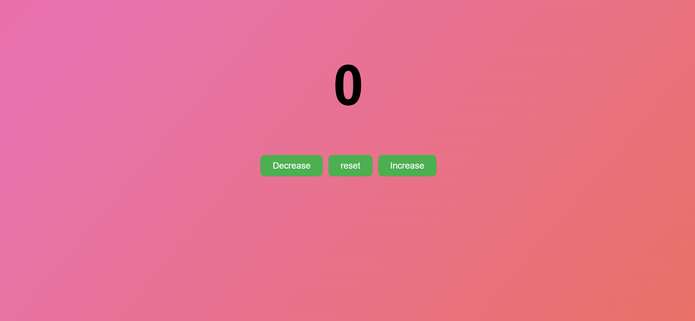

# 🔢 Counter App

A simple and interactive **Counter App** built using **HTML, CSS, and JavaScript**. This project allows users to increase, decrease, and reset the counter value with a visually appealing animated gradient background.



## ✨ Features

* ➕ Increase the counter value
* ➖ Decrease the counter value
* 🔄 Reset the counter to zero
* 🎨 Dynamic color changes:

  * Green for increment
  * Red for decrement
  * White for reset
* 🌈 Animated gradient background
* 📱 Responsive and user-friendly design
* ⚡ Fast and lightweight implementation

## 🛠️ Technologies Used

* HTML5
* CSS3
* JavaScript (ES6)

## 📂 Project Structure

```text
counter-app/
├── assets/
│   └── counter-preview.png
├── index.html
├── count.css
├── count.js
└── README.md
```

## 🚀 Getting Started

### Clone the Repository

```bash
git clone https://github.com/kothurisaiteja/counter-app.git
```

### Navigate to the Project Folder

```bash
cd counter-app
```

### Run the Project

Open `index.html` in your preferred web browser.

## 📸 Preview

The application features:

* A large counter display
* Increase, Decrease, and Reset buttons
* Animated gradient background
* Color feedback based on user actions

## 🎯 Learning Outcomes

Through this project, I gained hands-on experience with:

* DOM Manipulation
* Event Handling
* Updating Text Content Dynamically
* CSS Animations and Keyframes
* JavaScript Variables and Functions
* Responsive UI Design

## 🔮 Future Improvements

* Keyboard shortcuts support
* Save counter value using Local Storage
* Dark/Light mode toggle
* Sound effects on button clicks
* Custom step increments

## 🌐 Live Demo

https://kothurisaiteja.github.io/counter-app/

## 👨‍💻 Author

**Sai Teja**

GitHub: https://github.com/kothurisaiteja

---

⭐ If you found this project useful, consider giving it a star!
